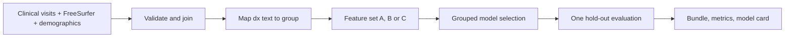
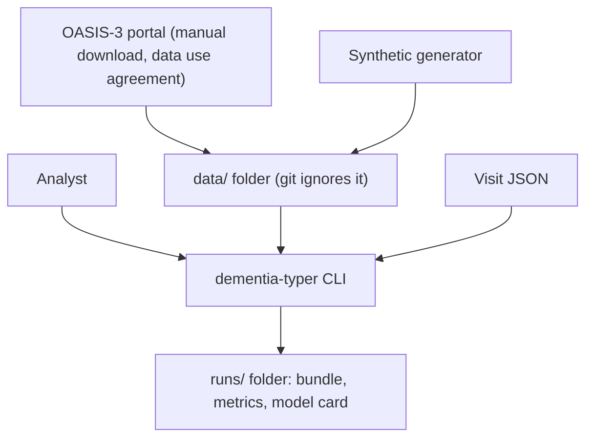
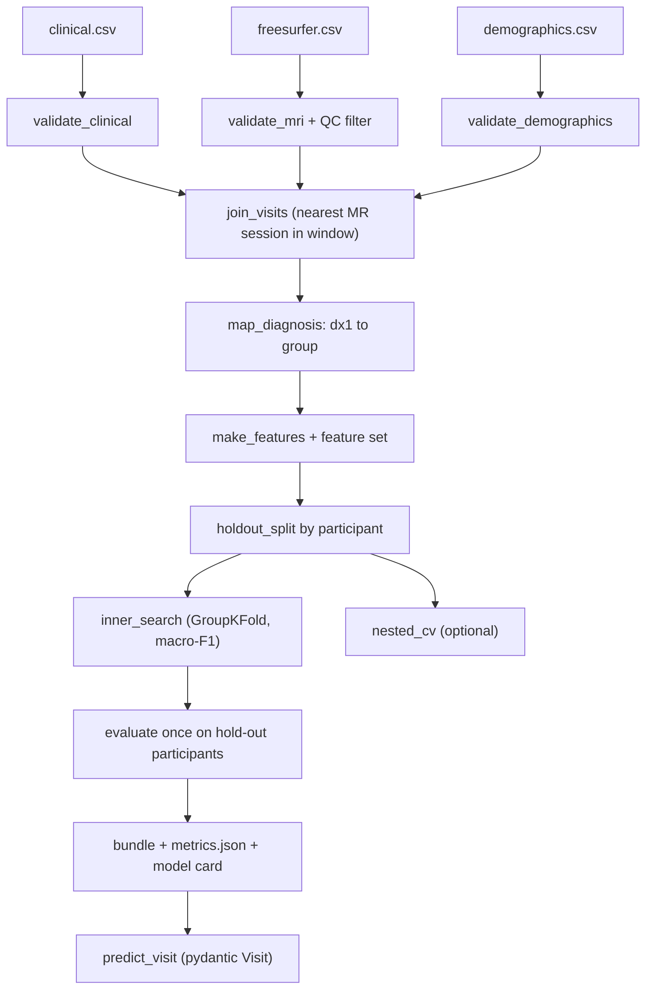

<div align="center">

# dementia-typer — Leakage-Aware Dementia Group Classification on OASIS-3

**dementia-typer is a research pipeline for analysts who study dementia groups in OASIS-3. It takes clinical visits and FreeSurfer volumes through these steps to a held-out, participant-level evaluation:**

`validate` → `join visits to MRI` → `map dx text` → `select by grouped CV` → `evaluate once` → `predict`.


**[Summary](#1-summary)** ·
**[Workflow](#4-the-end-to-end-workflow)** ·
**[Run it](#14-how-to-run-dementia-typer)** ·
**[Configuration](#144-environment-variables)** ·
**[Known problems](#17-known-problems)** ·
**[Glossary](#19-glossary)**

</div>

> [!NOTE]
> This README uses ASD-STE100 Simplified Technical English. The writing rules and the project
> vocabulary are in [`docs/ste-style-guide.md`](docs/ste-style-guide.md). Each term in the
> [Glossary](#19-glossary) has only one meaning.

---

> [!WARNING]
> Do not use dementia-typer to diagnose a person. It is a research tool, not a medical device.
> A clinician must make every diagnosis. OASIS-3 comes from one research cohort, so the results can be biased for other populations.

dementia-typer classifies OASIS-3 visits into five groups: Normal, MCI, Alzheimer's, Vascular and Other dementia.
The main feature set uses only demographics and MRI volumes. The CDR scores that clinicians use to assign the diagnosis appear only in a reference "leakage ceiling".
Every split keeps the visits of one participant together, and the hold-out test participants are used once, after the model selection.
Each prediction goes through a pydantic schema and returns group names from one fixed class list.

This README is the **one location that explains all of dementia-typer**. It gives these topics:

- the general design
- each component and its procedure, step by step
- the decision rules
- the data map
- the runbook
- the validation results and the known problems

| If you are… | Read |
|---|---|
| A manager or reviewer | [1](#1-summary), [3](#3-design-rules), [4](#4-the-end-to-end-workflow), [16](#16-validation-results), [18](#18-key-points) |
| A developer who joins the project | All sections, in sequence. Keep [14](#14-how-to-run-dementia-typer) and [17](#17-known-problems) open while you work |
| An analyst who runs dementia-typer | [14](#14-how-to-run-dementia-typer), then the section for the component that you use |

---

## Table of contents

1. 🧭 [Summary](#1-summary)
2. 🏗️ [How dementia-typer is built](#2-how-dementia-typer-is-built)
   - 2.1 [Components](#21-components)
   - 2.2 [System context](#22-system-context)
   - 2.3 [Repository layout](#23-repository-layout)
3. 🛡️ [Design rules](#3-design-rules)
4. 🔄 [The end-to-end workflow](#4-the-end-to-end-workflow)
   - 4.1 [Full flow](#41-full-flow)
   - 4.2 [The life cycle of one visit](#42-the-life-cycle-of-one-visit)
5. 🔵 [Tables and the visit-to-MRI join](#5-tables-and-the-visit-to-mri-join)
6. 🏷️ [The diagnosis rules](#6-the-diagnosis-rules)
7. 🟢 [Feature sets](#7-feature-sets)
8. 🟣 [Participant splits and model selection](#8-participant-splits-and-model-selection)
9. 📏 [Evaluation and explanations](#9-evaluation-and-explanations)
10. 🔎 [The leak check](#10-the-leak-check)
11. 🧾 [Bundles, model cards and prediction](#11-bundles-model-cards-and-prediction)
12. ⚖️ [The decision rules](#12-the-decision-rules)
13. 🗂️ [Data and file map](#13-data-and-file-map)
14. ▶️ [How to run dementia-typer](#14-how-to-run-dementia-typer)
    - 14.1 [Prerequisites](#141-prerequisites) · 14.2 [Installation](#142-installation) · 14.3 [Run dementia-typer](#143-run-dementia-typer) · 14.4 [Environment variables](#144-environment-variables)
15. 🧩 [How to extend dementia-typer](#15-how-to-extend-dementia-typer)
16. ✅ [Validation results](#16-validation-results)
17. ⚠️ [Known problems](#17-known-problems)
18. 📌 [Key points](#18-key-points)
19. 📖 [Glossary](#19-glossary)
20. 📄 [License](#20-license)

---

## 1. Summary

**The problem.** OASIS-3 has many visits for each participant, free-text diagnoses and scores that clinicians use to make the diagnosis. These questions are difficult:

- How do you map the `dx1` texts to groups without wrong substring matches?
- How do you keep one participant out of both training and test?
- How much of the accuracy comes from CDR, which defines the diagnosis?
- How do you select a model without a look at the test set?
- How do you predict one visit without a hand-written feature order?

dementia-typer gives each of these questions its own component. Each component has a validated input and a tested output.

| Item | Value |
|---|---|
| Input | `clinical.csv` (required), `freesurfer.csv` and `demographics.csv` (optional) |
| Output | Model bundle, `metrics.json`, model card, ablation table, prediction JSON |
| Components | **11** modules: config, labels, data, features, modeling, evaluate, train, predict, explain, synthetic, plus the CLI |
| Groups | Normal, MCI, Alzheimer's, Vascular, Other dementia |
| Models | `majority` baseline, `logreg`, `forest` (default candidates), `boosting` (optional) |
| Offline mode | Synthetic tables, all commands and all tests. No download and no key |
| Safety | Participant-grouped splits. Selection on training participants only. CDR only in the ceiling set |
| Tests | **55** unit tests (`pytest`), 1 more skips without the optional `shap` package |



---

## 2. How dementia-typer is built

### 2.1 Components

| Component | Module | Purpose |
|---|---|---|
| Settings | `src/dementia_typer/config.py` | Environment variables: folders, seed, join window, number of folds |
| Diagnosis rules | `src/dementia_typer/labels.py` | `CLASSES`, ordered rules, unmapped report, encode and decode |
| Tables and join | `src/dementia_typer/data.py` | Schema checks, QC filter, visit-to-MRI join |
| Feature sets | `src/dementia_typer/features.py` | Features normalized by intracranial volume, sets `A`, `B`, `C` |
| Splits and selection | `src/dementia_typer/modeling.py` | Participant hold-out, pipelines, grids, inner search, nested CV |
| Metrics | `src/dementia_typer/evaluate.py` | Macro-F1, balanced accuracy, recall, AUROC, Brier, ECE, bootstrap |
| Experiments | `src/dementia_typer/train.py` | Experiment, leak check, bundle, model card |
| Prediction | `src/dementia_typer/predict.py` | Pydantic `Visit` schema and `predict_visit` |
| Explanations | `src/dementia_typer/explain.py` | SHAP values (optional extra) |
| Synthetic data | `src/dementia_typer/synthetic.py` | OASIS-3-like tables with progression and CDR leakage |
| CLI | `src/dementia_typer/cli.py` | `synth`, `validate`, `train`, `ablation`, `leakage`, `predict`, `demo` |

### 2.2 System context



### 2.3 Repository layout

```
dementia-typer/
├── .github/workflows/ci.yml       # CI: install .[dev], run pytest
├── data/README.md                 # source, terms, expected files, procedure
├── docs/ste-style-guide.md        # writing rules and project vocabulary
├── src/dementia_typer/
│   ├── config.py                  # settings from environment variables
│   ├── labels.py                  # classes and diagnosis rules
│   ├── data.py                    # schema checks and the visit-to-MRI join
│   ├── features.py                # feature sets A, B, C
│   ├── modeling.py                # splits, pipelines, inner search, nested CV
│   ├── evaluate.py                # metrics and participant bootstrap
│   ├── train.py                   # experiments, leak check, bundle, model card
│   ├── predict.py                 # pydantic schema and prediction
│   ├── explain.py                 # optional SHAP
│   ├── synthetic.py               # synthetic tables
│   └── cli.py                     # command-line interface
├── tests/                         # 56 tests (1 needs the optional shap package)
├── .env.example                   # variable names only
└── pyproject.toml                 # package, extras, console script
```

---

## 3. Design rules

### 3.1 CDR is a ceiling, not a feature of the main model

Clinicians use the CDR boxes, `CDRSUM` and `CDRTOT` to assign the diagnosis. `features.py` puts them only in feature set `C`. The model card of a set `C` bundle has a warning that its result is a leakage ceiling.

### 3.2 One participant, one side of each split

`modeling.holdout_split` holds out whole participants, stratified by the group of their last visit. The inner search uses `GroupKFold` on `OASISID`. `assert_disjoint` stops the run if a participant is on both sides.

### 3.3 The test set never selects a model

`inner_search` selects the candidate and its parameters by the inner grouped macro-F1 on the training participants. The hold-out test is used once, after the selection. `--nested` adds an outer grouped CV that estimates the error of the full selection procedure.

### 3.4 The preprocessor is inside the pipeline

The imputer, the scaler and the selector are steps of one scikit-learn `Pipeline`. Each fit uses only the rows of its fold. Permutation importance uses the hold-out test participants.

### 3.5 One class list

`labels.CLASSES` fixes the order of the five groups. The bundle stores the class list, and `load` refuses a bundle with a different list. Predictions return group names, never bare integers.

### 3.6 Explicit diagnosis rules

`labels.RULES` is an ordered list of word-boundary patterns. "Non AD dementia" maps to Other dementia, not to Alzheimer's. A text that no rule matches gives no group and appears in the `validate` output.

### 3.7 Validated input for prediction

`predict.Visit` is a pydantic model with named fields, ranges and `extra="forbid"`. The bundle gives the feature order. The output lists the features that the imputer filled.

---

## 4. The end-to-end workflow

### 4.1 Full flow



### 4.2 The life cycle of one visit

1. `validate_clinical` reads the visit row and checks the key, the age and the MMSE range.
2. `join_visits` attaches the nearest passed MR session of the same participant within 365 days.
3. `map_diagnosis` changes the `dx1` text into a group. If no rule matches, the visit leaves the analysis.
4. `make_features` divides each volume by the intracranial volume and adds the demographic values.
5. The split puts the visit, with all other visits of its participant, in training or in the hold-out test.
6. If the visit is in training, it helps the inner search to select a candidate.
7. If the visit is in the test, the selected pipeline gives five group probabilities for it.

---

## 5. Tables and the visit-to-MRI join

**Purpose.** Make one row for each clinical visit with the MRI volumes of a close MR session.

| Input | Output |
|---|---|
| Clinical, FreeSurfer and demographics tables | Visit table with volumes, `scan_gap_days`, demographics and `group` |

**Procedure**

1. If `days_to_visit` is missing, read the day from `OASIS_session_label` (suffix `_dNNNN`).
2. Check the required columns, unique visits and the MMSE range (0–30).
3. Keep only MR sessions with a passed `FS QC Status`, if the column exists.
4. For each visit, take the MR session of the same participant with the smallest day distance, if it is not more than `DEMENTIA_JOIN_WINDOW_DAYS`.
5. Add the demographics of the participant and map the `dx1` text to a group.

**Rules**

- A join never crosses participants.
- A visit with no MR session in the window keeps empty volumes. The imputer of the pipeline fills them.

---

## 6. The diagnosis rules

**Purpose.** Map each `dx1` text to one group, or to no group.

| Order | Group | Pattern (on lower-case text) | Examples |
|---|---|---|---|
| 1 | MCI | `uncertain`, `incipient`, `0.5 in memory`, `ques. impair`, `questionable`, `impair reversible`, `mci`, `mild cognitive`, `w/o dement` | "0.5 in memory only", "uncertain- possible NON AD dem" |
| 2 | Normal | `cognitively normal`, `no dementia`, `normal` | "Cognitively normal" |
| 3 | Other dementia | `non ad`, `non-ad`, `nonad` | "Non AD dem- Other primary" |
| 4 | Vascular | `vascular`, `vad` | "Vascular Demt- primary" |
| 5 | Alzheimer's | `ad`, `dat`, `alzheimer` (whole words) | "AD Dementia", "DAT" |
| 6 | Other dementia | `dlbd`, `lewy`, `frontotemporal`, `ftd`, `pdd`, `parkinson`, `dementia/pd`, `huntington`, `prion`, `alcohol`, `other primary`, a word that starts with `dem` | "DLBD- primary" |

The first rule that matches wins. The rules use word boundaries, so "headache" does not match `ad`. `validate` returns exit code 2 and lists each text with no rule.

---

## 7. Feature sets

| Set | Columns | Use |
|---|---|---|
| `A` | `age`, `sex_male`, `education_years`, `icv_l`, 9 volumes divided by intracranial volume (per mille) | Main model: an objective signal with no cognitive test |
| `B` | `A` + `MMSE` | A short cognitive test added |
| `C` | `B` + `memory`, `orient`, `judgment`, `commun`, `homehobb`, `perscare`, `CDRSUM`, `CDRTOT` | Leakage ceiling for reference only |

The 9 volumes: `TotalGrayVol`, `CortexVol`, `CorticalWhiteMatterVol`, `SubCortGrayVol`, `Left-Hippocampus`, `Right-Hippocampus`, `Left-Lateral-Ventricle`, `Right-Lateral-Ventricle`, `CSF`.

---

## 8. Participant splits and model selection

**Purpose.** Select one pipeline with the training participants only, and keep the test participants for one final measurement.

| Input | Output |
|---|---|
| Feature table, groups, `OASISID` | Selected pipeline, search log, optional nested CV scores |

**Procedure**

1. Give each participant the group of the last visit. Groups with fewer than 5 participants share one stratum.
2. Put one fold of a 5-fold stratified split of the participants in the hold-out test (about 20%).
3. For each candidate (model × selector), run a grid search with `GroupKFold` and macro-F1.
4. Keep the candidate with the highest inner macro-F1, refit on all training participants.
5. With `--nested`, repeat steps 3 and 4 inside an outer 5-fold grouped CV of the training participants.

| Model | Estimator | Grid |
|---|---|---|
| `majority` | `DummyClassifier(most_frequent)` | none (baseline) |
| `logreg` | `LogisticRegression(class_weight="balanced")` | `C` in 0.1, 1, 10 |
| `forest` | `RandomForestClassifier`, 200 trees, `balanced_subsample` | `max_depth` in None, 8. `min_samples_leaf` in 1, 5 |
| `boosting` | `HistGradientBoostingClassifier`, `class_weight="balanced"` | `learning_rate` in 0.05, 0.1. `max_leaf_nodes` in 15, 31 |

| Selector | Step |
|---|---|
| `none` | no selection |
| `mi` | `SelectKBest` with mutual information, `k` features (default 8) |
| `rfe` | `RFE` with a logistic regression, `k` features |

---

## 9. Evaluation and explanations

| Metric | Meaning |
|---|---|
| `macro_f1` | Mean F1 over the groups that occur in the test. The main metric |
| `balanced_accuracy` | Mean recall over the groups that occur |
| `recall`, `precision` | For each group. Recall is `NaN` for a group with no test visit |
| `absent_classes` | Groups with no test visit |
| `macro_auroc_ovr` | Mean one-vs-rest AUROC |
| `brier` | Multi-class Brier score |
| `ece` | Top-label expected calibration error, 10 bins |
| `confusion_matrix` | Rows: true group. Columns: predicted group. Order of `CLASSES` |
| CI | 95% participant bootstrap interval of macro-F1 and balanced accuracy (default 200 draws) |

Permutation importance shuffles one feature at a time on the test participants and measures the drop in macro-F1 (3 repeats). With the `explain` extra, `explain.shap_values` gives SHAP values for held-out visits.

---

## 10. The leak check

`leakage_check` trains one fixed forest on feature set `A` two times:

1. With a visit-level stratified split, where one participant can be in training and test.
2. With the participant-level hold-out split.

The difference of the two macro-F1 values shows how much a visit-level split overstates the result. A model can know a participant again from the fixed brain size of that participant.

---

## 11. Bundles, model cards and prediction

`train.save` writes three files:

| File | Contents |
|---|---|
| `model.joblib` | Pipeline, feature list, `CLASSES`, feature set, chosen candidate, package version |
| `metrics.json` | Search log, test metrics, baseline metrics, CIs, nested scores, importance |
| `model_card.md` | Intended use, features, split sizes, metrics, warning for set `C` |

**Prediction procedure**

1. Read a JSON object. Field names are the column names (for example `age at visit`, `Left-Hippocampus`, `MMSE`).
2. Validate it with `Visit`. Unknown fields and values out of range give an error and exit code 1.
3. Make the features in the order of the bundle.
4. Return the predicted group, the five probabilities, the filled features and a note that a clinician must make the diagnosis.

---

## 12. The decision rules

| Value | Where | Number |
|---|---|---|
| Join window | `DEMENTIA_JOIN_WINDOW_DAYS` | 365 days |
| QC values kept | `data.QC_PASSED` | `passed`, `pass`, `ok` |
| MMSE range | `validate_clinical`, `Visit` | 0–30 |
| Age range for prediction | `Visit.age` | 18–110 years |
| CDR box range | `Visit` | 0–3 (`CDRSUM` 0–18) |
| Hold-out size | `holdout_split(test_fraction=...)` | 0.2 of the participants |
| Rare stratum | `holdout_split` | fewer than 5 participants in a group |
| Inner folds | `DEMENTIA_N_SPLITS` | 5 (minimum 2) |
| Selector size | `--k` | 8 features |
| Bootstrap draws | `--bootstrap` | 200 |

---

## 13. Data and file map

| Path | Committed? | Contents |
|---|---|---|
| `data/README.md` | Yes | Source, terms, expected files, procedure |
| `data/oasis3/*.csv` | No (git ignores `/data/*`) | OASIS-3 exports (data use agreement) |
| `data/synthetic/*.csv` | No | Output of `dementia-typer synth` |
| `runs/set_<A/B/C>/model.joblib` | No | Bundle |
| `runs/set_<A/B/C>/metrics.json` | No | Metrics and search log |
| `runs/set_<A/B/C>/model_card.md` | No | Model card |
| `.env` | No | Local settings |

Do not commit a bundle trained on OASIS-3. It is derived from data under the data use agreement.

---

## 14. How to run dementia-typer

### 14.1 Prerequisites

| Need | For |
|---|---|
| Python 3.11+ | All components |
| OASIS-3 access | Real results (see [`data/README.md`](data/README.md)). The demo and the tests do not need it |
| `shap` (extra `explain`) | SHAP values only |

### 14.2 Installation

```bash
git clone https://github.com/KrishnaAnnavaram/dementia-typer.git
cd dementia-typer
python -m venv .venv
. .venv/bin/activate            # Windows: .venv\Scripts\activate
pip install -e ".[dev]"         # add ,explain for SHAP
```

### 14.3 Run dementia-typer

Offline demo (synthetic data, about three minutes on a laptop):

```bash
dementia-typer demo
```

Step by step:

```bash
dementia-typer synth --out data/synthetic --subjects 300 --seed 0
dementia-typer validate --data data/synthetic
dementia-typer leakage --data data/synthetic
dementia-typer train --data data/synthetic --feature-set A --nested --out runs/set_A
dementia-typer ablation --data data/synthetic
dementia-typer predict --model runs/set_A/model.joblib --input visit.json
```

Example `visit.json`:

```json
{"age at visit": 68, "sex": "F", "education_years": 16, "IntraCranialVol": 1400000,
 "Left-Hippocampus": 3800, "Right-Hippocampus": 3900, "MMSE": 30}
```

| Command | What it does | Exit code |
|---|---|---|
| `synth` | Writes synthetic `clinical.csv`, `freesurfer.csv`, `demographics.csv` | 0 |
| `validate` | Checks the tables and the join, counts the groups, lists dx texts with no rule | 0 OK, 2 texts with no rule, 1 error |
| `train` | Hold-out, inner search, optional nested CV, test, bundle and model card | 0 |
| `ablation` | Runs feature sets `A`, `B`, `C` and prints the metrics of each | 0 |
| `leakage` | Visit-level vs. participant-level macro-F1 | 0 |
| `predict` | Validates one visit JSON and prints group probabilities | 0, 1 for a schema error |
| `demo` | Synthetic data, validation, leak check, sets `A`, `B`, `C` | 0 |

### 14.4 Environment variables

| Variable | Used by | Meaning |
|---|---|---|
| `DEMENTIA_DATA_DIR` | `config.Settings` | Default data folder (default `data/oasis3`) |
| `DEMENTIA_OUTPUT_DIR` | `train` | Run folder (default `runs`) |
| `DEMENTIA_SEED` | splits, models, bootstrap | Seed (default 42) |
| `DEMENTIA_JOIN_WINDOW_DAYS` | `join_visits` | Maximum visit-to-scan distance (default 365) |
| `DEMENTIA_N_SPLITS` | inner and nested CV | Number of grouped folds (default 5, minimum 2) |

dementia-typer needs no credentials. `.env.example` gives the variable names. Git ignores `.env`.

---

## 15. How to extend dementia-typer

| You want to… | Do this | Code change? |
|---|---|---|
| Map a new dx text | Add a pattern to `labels.RULES` and a test case in `tests/test_labels.py` | Small |
| Add a volume | Add the column to `data.MRI_VOLUMES` and a field to `predict.Visit` | Small |
| Add a feature set | Add an entry to `features.FEATURE_SETS` and `SET_DESCRIPTIONS` | Small |
| Add a model | Add a branch to `build_pipeline` and a grid to `GRIDS` | Small |
| Use the boosting model | `train --models logreg forest boosting` | No |
| Add calibration | Wrap the selected pipeline in `CalibratedClassifierCV` with grouped folds | Yes |

---

## 16. Validation results

All numbers below come from this repository. The model numbers use **synthetic data** (`dementia-typer demo`, 300 participants, seed 0). They do not describe OASIS-3 participants.

| Validation | Result | Command |
|---|---|---|
| Unit tests (local, Python 3.13) | **55 passed, 1 skipped** (SHAP) | `pytest -q` |
| Unit tests (clean venv with `.[dev]` only, as in CI) | **55 passed, 1 skipped** | `pip install -e ".[dev]" && pytest -q` |
| Join and rules (synthetic) | 879 visits, 300 participants, 724 visits with an MR session in 365 days, 0 unmapped texts | `dementia-typer validate` |
| Leak check, forest macro-F1 (synthetic) | Visit split 0.711, participant split 0.628, gap 0.082 | `dementia-typer leakage` |
| Split sizes (synthetic) | 240 training and 60 test participants (705 and 174 visits) | `dementia-typer train` |
| Nested CV, set `A` (synthetic) | Mean macro-F1 0.611 over 5 outer folds of the training participants | `dementia-typer train --nested` |
| Top permutation importance, set `A` (synthetic) | `CorticalWhiteMatterVol_icv` 0.191, `Right-Hippocampus_icv` 0.136, `Left-Hippocampus_icv` 0.098 (drop in macro-F1) | `dementia-typer train` |

Hold-out test on synthetic data (participant split, majority baseline macro-F1 0.139, accuracy 0.534):

| Feature set | Selected | Macro-F1 (95% participant CI) | Balanced accuracy | Accuracy | Macro AUROC | ECE |
|---|---|---|---|---|---|---|
| `A` demographics + MRI | `logreg`, no selector | 0.640 (0.522–0.757) | 0.683 | 0.678 | 0.880 | 0.096 |
| `B` + MMSE | `forest`, no selector | 0.858 (0.691–0.957) | 0.841 | 0.920 | 0.981 | 0.109 |
| `C` + CDR (ceiling) | `logreg`, no selector | 0.911 (0.794–1.000) | 0.909 | 0.971 | 0.999 | 0.034 |

The generator makes CDR follow the group almost exactly. Thus set `C` is close to perfect for Normal, MCI and Alzheimer's, and this shows the leakage. CDR does not separate the dementia types, so the recall of Other dementia stays at 0.55 in all sets.
The leak check shows that a visit-level split gives a higher macro-F1 than a participant split.
These numbers prove that the pipeline and its checks work. They do not give the accuracy on OASIS-3.

The earlier prototype reported about 96% accuracy on OASIS-3. That number is a prototype result, not reproduced here. It used CDR features and a visit-level split, so this project does not compare with it.

---

## 17. Known problems

Read these problems before you use dementia-typer for a publication.

| # | Area | Problem | Impact and action |
|---|---|---|---|
| 1 | Real data | CI runs on synthetic data only. Results on OASIS-3 are not reproduced in CI | Run `ablation` on your OASIS-3 export and review each table |
| 2 | Diagnosis rules | The rules cover the common `dx1` texts. OASIS-3 has more texts, and some are ambiguous ("uncertain, possible AD") | Run `validate` and extend `labels.RULES`. Have a clinician review the map |
| 3 | Small groups | Vascular and Other dementia have few participants. Their CIs are wide | Report the CI and the support of each group |
| 4 | Calibration | The selected pipeline is not calibrated. ECE is 0.03–0.11 on synthetic data | Do not read the probabilities as risks |
| 5 | Cohort bias | OASIS-3 participants are volunteers from one research center | Do not generalize to other populations without external validation |
| 6 | Column names | The FreeSurfer export uses other column names in some releases | Rename the columns to the names in `data/README.md` |
| 7 | Boosting speed | `HistGradientBoostingClassifier` was very slow on a loaded Windows host with 5 classes | It is not a default candidate. Add it with `--models` on a quiet machine |
| 8 | Visit order | Visits of one participant are not independent. The bootstrap resamples participants, but the metrics weight participants by their visit count | Report a last-visit evaluation for each participant if you need one weight for each person |
| 9 | Inner CV | The grid search uses `GroupKFold` without stratification. A small group can be absent from an inner fold | Use fewer folds for small datasets |

---

## 18. Key points

1. **The main model does not see CDR.** CDR appears only in the leakage ceiling set `C`, with a warning in the model card.
2. **Participants never cross a split.** The hold-out, the inner search and the nested CV group by `OASISID`.
3. **The test set measures, it does not select.** The inner grouped macro-F1 selects the candidate.
4. **One class list from training to prediction.** The bundle stores `CLASSES`, and predictions return names.
5. **Inputs are validated.** A pydantic schema checks each prediction input, and a schema check covers each table.
6. **All of it runs offline.** Synthetic tables feed the demo and the 55 tests.

---

## 19. Glossary

| Term | Meaning |
|---|---|
| **OASIS-3** | Open Access Series of Imaging Studies, a longitudinal dataset of aging and dementia |
| **participant** | One person, identified by `OASISID` |
| **visit** | One clinical visit of a participant |
| **MR session** | One MRI scan with FreeSurfer volumes |
| **join window** | The maximum distance in days between a visit and its MR session |
| **group** | One of the 5 classes: Normal, MCI, Alzheimer's, Vascular, Other dementia |
| **MCI** | Mild cognitive impairment: impairment without a confirmed dementia |
| **CDR** | Clinical Dementia Rating: six boxes, the sum (`CDRSUM`) and the global score (`CDRTOT`) |
| **MMSE** | Mini-Mental State Examination, 0 to 30 |
| **feature set** | `A`, `B` or `C`: the feature columns of an experiment |
| **leakage ceiling** | The result of set `C`, which contains the scores that define the diagnosis |
| **candidate** | One model and selector pair |
| **inner search** | The grouped grid search on the training participants |
| **nested CV** | An outer grouped CV around the inner search |
| **hold-out test** | The participants that the selection never sees |
| **bundle** | `model.joblib`: pipeline, features, classes and feature set |
| **ECE** | Expected calibration error of the top predicted group |
| **macro-F1** | Mean F1 over the groups that occur in the test |

---

## 20. License

[MIT](LICENSE) © 2026 Krishna Annavaram
